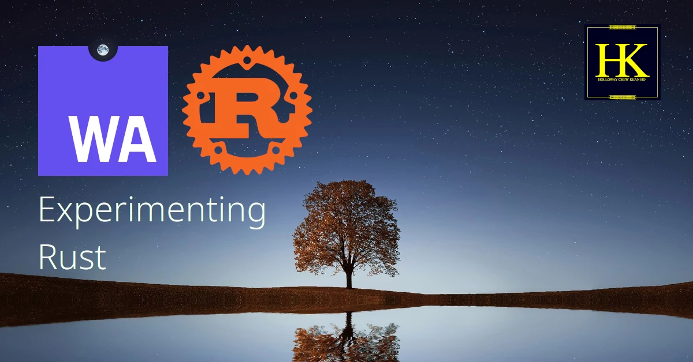

# Holloway's Rust Experiments


This is the principle repository for (Holloway) Chew, Kean Ho's experimentation
to develop a pure Rust application, both local and web including supporting
[Progressive Web Application](https://web.dev/progressive-web-apps/) offline
mode alongside using pure Go to develop web application entirely.


## 3rd-Party Dependencies
Here are the list of 3rd-party dependencies used so far:

1. ZORALab's Monteur - https://monteur.zoralab.com
2. Rust - https://www.rust-lang.org/
3. Hugo - https://gohugo.io/


## (1) Utilize Local CI - Monteur
The FIRST technology chosen was [ZORALab's Monteur](https://monteur.zoralab.com)
to manage the repository development continuously and controls with confidences
when deploying the repository in a decentralized manner.

The first step you need to do would be installing Monteur as per instructed in
their official website.

Once the `monteur` program is available, proceed to your own copy and perform:

```bash
$ monteur setup
```

Monteur shall setup all the repository's dependencies and configurations
seamlessly. Repeat this `monteur setup` command whenever there is an update from
Monteur Setup Job recipes OR something went wrong with the current setup in
your repository.


## (2) Local Development
The second step is to bring up your local development. Monteur setup local
filesystem inside the repository. Hence, whenever you open a new terminal to
wanting to develop this repository, simply do the following:

```bash
$ source .monteurFS/config/main
```

Once done, the terminal you're in is now configured to be repository specific.
You're now ready to develop the repository. All instructions beyond this step
**assumes you always this step**.

> **NOTE**
>
> Whenever you find any software that is missing in action, you're likely
> forgotten this step.


## (3) Local Hosting Hugo
The SECOND technology selected was `hugo` for simple static site generations.
The repository is designed in a way that it can operate in offline or bad
connectivity environments. To do that, execute:

```
.configs/hugo/server.cmd
```

Once done, please visit the URL site presented in the terminal. The default
is: http://localhost:8080

If you need to work on something else, you need to setup a new terminal again.


## (4) Rust Workspace
The THIRD technologies selected were `rust` for its development in its
simplicity and portability sake. In order to work on the Rust project, you need
to open a new terminal, perform the Step (2) for it, and then change directory
into `expRust`. That is the root location of the Rust source codes and its
workspace.

```
cd expRust
```

While the workspace is for this repository, the file structures are arranged
into 2 different locations: `expRust`, and `hestiaRust`. The minimal file
structure is as follows:

```
.
├── app
│   └── candidate
│       └── ...
├── hestiaRust
│   ├── ...
│   └── ...
...
```

Each location has its specific roles to prevent vendor locked-in threat while
maintaining Rust's quality in package modularlities. They key roles are:

1. `expRust` - the repository base.
2. `hestiaRust` - the common library crates that will be upstreamed to:
   https://github.com/ZORALab/Hestia

To prevent supply-chain nightmare from affecting any project, this exploration
is set to have all dependent source codes placed here.


## (5) Testing Go Workspace
With Monteur Test CI Job made available, given the correct recipe, Monteur
can perform either pinpoint or recursive testing against Rust crates. All the
user needs to do is:

```
$ monteur test
```

And then all the necessary result data files are generated into the package
directory itself.


## (6) Building Rust Application
With Monteur Build CI Job made available, given the correct recipe, Monteur
can peform percise Rust build in a reproducible manner. All the user needs to do
is:

```
$ monteur build
```


## (7) Package Rust Application
With Monteur Package CI Job made available, given the correct recipe, Monteur
can peform proper packaging in a reproducible manner. All the user needs to do
is:

```
$ monteur package
```


## (8) Release to Hugo
With Monteur Release CI Job made available, given the correct recipe, Monteur
can peform proper manage the Rust application systematically. All the user needs
to do is:

```
$ monteur release
```

At this point, Rust development is considered completed.


## (9) Compose Static Site Generations
With Monteur Compose CI Job made available, given the correct recipe, Monteur
can properly compose Hugo's website artifact for web publications. All the user
needs to do is:

```
$ monteur compose
```

At this point, Hugo development is considered completed.


## (10) Publish the Static Site Artifact
With Monteur Publish CI Job made available, given the correct recipe, Monteur
can properly publish the composed website artifact to the public. All the user
needs to do is:

```
$ monteur publish
```

At this point, the development is considered deployed.


## License
The repository is licensed under MIT License.
